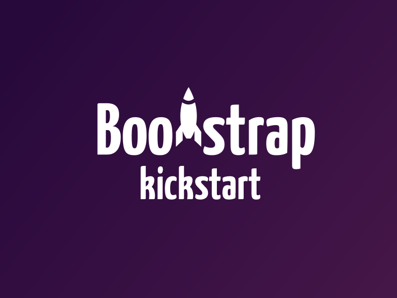

[](https://travis-ci.org/micromata/bootstrap-kickstart)
[](https://david-dm.org/micromata/bootstrap-kickstart#info=devDependencies)
[](https://gitter.im/micromata/bootstrap-kickstart?utm_source=badge&utm_medium=badge&utm_campaign=pr-badge&utm_content=badge)
[](https://twitter.com/BootstrapKick)
[](https://www.youtube.com/watch?v=qRC4Vk6kisY)

#Kickstarter for Bootstrap themes



The aim of this repository is to help you with the creation of Bootstrap themes and sites by providing:

- a file structure with focus on maintainibilty and upgradability
- a Grunt workflow with the following »features«
	- compile and minify our code
	- add sourcemaps for JavaScript and CSS
	- get rid of `console` output in production files
	- add vendor prefixes
	- optimize images (lossless)
	- start a local server
	- keep browsers in sync for testing
	- delete unused CSS (optional)
	- release new versions
	- and more.

## Table of Contents

- [Quick install guide](#quick-install-guide)
- [Dependencies](#dependencies)
- [Setting up the project](#setting-up-the-project)
- [Grunt Workflow and tasks](#grunt-workflow-and-tasks)
- [Setting up your Editor (optional)](#setting-up-your-editor-optional)
- [Writing Markup (using pages, templates and partials)](#writing-markup-using-pages-templates-and-partials)
- [File and folder structure of LESS files](#file-and-folder-structure-of-less-files)
- [Using external libraries](#using-external-libraries)
- [Browser support](#browser-support)
- [Contributing to this project](#contributing-to-this-project)
- [License](#license)

## Quick install guide

For those already using Node, Grunt and stuff.

### via Yeoman

	$ npm install -g yo
	$ npm install -g generator-bootstrap-kickstart
	$ yo bootstrap-kickstart

See: <https://github.com/micromata/generator-bootstrap-kickstart>

### via Git

	$ git clone https://github.com/micromata/bootstrap-kickstart.git
	$ cd bootstrap-kickstart
	$ npm install
	$ grunt tasks

## Dependencies

- Node.js
- Grunt

### Node.js

The major dependency is [Node.js](http://nodejs.org/) including the Node.js package manager called »npm«. The other depencies can be installed with npm.

Please enter the following in your terminal if your aren’t sure about the availability of Node.js and npm on your machine:

	npm --version

This should return something like the following in case Node.js and npm is already installed:

	3.3.3

If that isn’t the case you have to install Node.js first. On OS X I strongly recommend installing Node via [Homebrew](http://brew.sh). Not just because it’s easier to switch versions with Homebrew but also because you prevent potential permission problems when running npm.

### Grunt

Like Bootstrap itself this project uses [Grunt](http://gruntjs.com/) for its build system, with convenient methods for working with the project. It's how we compile and minify our code, at vendor prefixes, optimize images, delete unused CSS, release new versions and more.

#### Installing Grunt

Thanks do Node.js and npm installing the Grunt command line tools globally is just this simple one-liner:

	npm install -g grunt-cli

<a name="setup"></a>
## Setting up the project

Navigate to the root of your checkout:

	cd path/to/your/checkout/of/bootstrap-kickstart

and call:

	npm install

npm will look at the `package.json` file and automatically fetch and install the necessary local dependencies needed for our grunt workflow as well as the needed frontend dependencies to `\node_modules`.

## Grunt Workflow and tasks

When completed the setup, you'll be able to run the various Grunt tasks provided from the command line.

Just type the following to get an overview about the available Tasks:

	grunt tasks

This will give you the main Grunt tasks which are ready for you to be fired from the terminal (grouped into »Dev« and »Production« Tasks):

````
Dev
default        =>  Default Task. Just type `grunt` for this one. Calls `grunt dev` first and `grunt server` afterwards.
dev            =>  `grunt dev` will lint your files, build sources within the assets directory and generating docs / reports.
sync           =>  `grunt sync` starts a local dev server, sync browsers and runs `grunt watch`
jsdoc          ->  `grunt jsdoc` generates source documentation using jsdoc.
serve          =>  `grunt serve` starts a local dev server and runs `grunt watch`
watch          >   `grunt watch` run dev tasks whenever watched files change and Reloads the browser with »LiveReload« plugin.
lint           =>  `grunt lint` lints JavaScript (ESLint) and HTML files (W3C validation and Bootlint)
lint:fix       =>  `grunt lint:fix` tries to fix your ESLint errors.

Production
build          =>  `grunt build` builds production ready sources to dist directory.
build:check    =>  `grunt build:check` starts a local server to make it possible to check the build in the browser.
release:patch  =>  `grunt release:patch` builds the current sources and bumps version number (0.0.1).
release:minor  =>  `grunt release:minor` builds the current sources and bumps version number (0.1.0).
release:major  =>  `grunt release:major` builds the current sources and bumps version number (1.0.0).
````
Running those tasks will create a bunch of directories and files which aren’t under version control. So don’t wonder when the following ressources are created after setting up the project:

````
bootstrap-kickstart/
├── assets/
│   ├── css/
│   │   ├── index.css          → Compiled and autoprefixed from LESS files
│   │   └── index.css.map      → Sourcemap which maps to LESS files
│   └── js/
│       ├── file.min.js        → Minified JavaScript file
│       └── file.min.js.map    → Sourcemap which maps to original js file
├── dist/                      → Contains the files ready for production
│   ├── assets/
│   │   ├── css/
│   │   │   ├── index.css      → Compiled and autoprefixed from LESS files
│   │   │   └── index.css.map  → Sourcemap which maps to LESS files
│   │   ├── fonts/             → Fonts copied from /assets/fonts
│   │   ├── img/               → Optimized images from /assets/img
│   │   └── js/
│   │       └── file.min.js    → Minified JavaScript file (without console output)
│   └── libs/                  → Relevant files copied from /libs
├── docs/                      → JavaScript generated from DocBlock comments
├── node_modules/              → Dependencies installed by npm
├── reports/                   → JavaScript Source Analysis
└── server/                    → Contains files for running a local dev server
````

See `/Gruntfile.js` to see what happens in Details.

### Setting up your Editor (optional)

We strongly advise to install an [EditorConfig plugin](http://editorconfig.org/#download) and take a look at the `.editorconfig` file in the root of this project.

Beside that we recommend setting up a project within in your editor if you don’t want to see these generated files cluttered all over your project. In case of Sublime Text it’s as easy as hitting »Project« → »Save Project As …« and adding the following to `projectName.sublime-project`.

```json
{
  "folders": [{
    "path": ".",
    "folder_exclude_patterns": [
      "node_modules",
      "server",
      "dist",
      "reports",
      "docs",
      "assets/css",
      "libs"
    ],
    "file_exclude_patterns": [
      "assets/js/*.min.js",
      "assets/js/*.min.js.map",
      ".*rc",
      ".editorconfig",
      ".gitignore",
      "*.zip",
      "*.md",
      "LICENSE",
      "*.json",
      "Gruntfile.js"
    ]
  }]
}
```

## Writing Markup (using pages, templates and partials)
Using [grunt-generator](https://github.com/clavery/grunt-generator) we can simplify our templates and avoid markup duplications by using a combination of `pages`, `templates` and `partials` (optional). grunt-generator uses [Handlebars](http://handlebarsjs.com/) under the hood to make that possible.

This is super easy to use even if you never used Handlebars before.
Because every valid HTML page is a valid Handlebars template. But handlebars gives you some extra power. So you can:

- write plain HTML
- use [built-In helpers](http://handlebarsjs.com/builtin_helpers.html) provided by handlebars
- go crazy with [custom helpers](http://handlebarsjs.com/block_helpers.html) :heart_eyes:

Let’s dive into it by describing a minimal example. Imagine that we have a simplified file/folder structure like the following in our project:

```
myProject
├── index.hbs                  → A page
├── anotherPage.hbs            → Another page
├── partials                   → Place to store our partials (usage optional)
│   └── footer.hbs
└── templates                  → Place to store our templates
    ├── default.hbs            → Our default template
    └── helpers
        └── helpers.js         → Place to store handlebars helpers (usage optional)
```

As you can see our pages are stored in the root of the project and are rendered as `html` pages with a little help of Handlebars.

Let’s take a look at the content of our files.

`/templates/helpers/helpers.js`:

```javascript
/**
 * Adds the current year to a string. Divides given string and year by a space.
 * @example:
 * {{addYear '©'}} --> © 2015
 */
var addYear = function (s) {
	return s + ' ' + new Date().getFullYear();
};

module.exports = {
	addYear: addYear
};
```

`/partials/footer.hbs`:

```html
<footer>
	{{addYear '©'}} MyCompany
</footer>
```

`/index.hbs`:

```html
---
title: Page title
---
<h1>My page</h1>

<p>My content</p>

{{> footer }}
```

`/templates/default.hbs `:

```html
<!DOCTYPE html>
<html>
<head>
	<meta charset="utf-8">
	<meta http-equiv="X-UA-Compatible" content="IE=edge">
	<title>My Project{{#if page.title}} - {{page.title}}{{/if}}</title>
	<link rel="stylesheet" href="">
</head>
<body>
	{{{body}}}
</body>
</html>
```

This combination will render to one html file.

`index.html`:

```html
<!DOCTYPE html>
<html>
<head>
	<meta charset="utf-8">
	<meta http-equiv="X-UA-Compatible" content="IE=edge">
	<title>My Project - Page title</title>
	<link rel="stylesheet" href="">
</head>
<body>
	<h1>My page</h1>

	<p>My content</p>

	<footer>
		© 2015 MyCompany
	</footer>
</body>
</html>
```

As you can see you can enrich your pages with data via so called frontmatters:

```
---
title: Page title
---
```

Frontmatters are basically a key/value storage you can access within your templates, pages and partials via Handlebars.  This enpowers you to do things like [handling active states](https://github.com/micromata/bootstrap-kickstart/blob/develop/partials/navbar.hbs#L16-L22) of your navigation and much more.

There is one predefined key which let you choose a different template in case you’re using more than one:

```
---
template: myOtherTemplate
---
```

This would need the presence of a template named `myOtherTemplate.hbs` in the `templates` directory to work properly. You don’t need to define the template within your Frontmatter in case you would like to use  the default template.

## File and folder structure of LESS files

This is s short version of our conventions when it comes to create bootstrap themes.  Below you’ll find a screenshot from `/assets/less`


Seems to be a pretty huge amount of files for such a little project. So here we go with an explanation.

### index.less
Our main LESS file which is the one which is creating our index.css file. This file is just about a few imports and setting the path to the icon fonts provided by bootstrap.

```css
// Bootstrap Core
// --------------------------------------------------
@import "../../libs/bootstrap/less/bootstrap.less";

// Set path to icon fonts
@icon-font-path: "../../libs/bootstrap/fonts/";

// Base styles
// --------------------------------------------------
// Independent of design (shared definitions).
// base.less is meant to be used for different themes for one customer.
@import "base.less";

// Corporate Design
// --------------------------------------------------
@import "theme.less";

////////// Do NOT insert style-definitions here! //////////
```

### base.less
Is used for shared definitions which makes sense when dealing with different themes for one customer/project. The defaults consist only of a few lines.

```css
// Base styles
// --------------------------------------------------
// Independent of design (shared definitions)
// base.less is meant to be used for different themes for one customer.

// Fix viewport issues with IE 10.
// See http://getbootstrap.com/getting-started/#support-ie10-width
@-webkit-viewport   { width: device-width; }
@-moz-viewport      { width: device-width; }
@-ms-viewport       { width: device-width; }
@-o-viewport        { width: device-width; }
@viewport           { width: device-width; }
```

### theme.less

We used this file to import the modules/files which defines the actual theme. You could also use this to write down your styles and omit the use of the seperate files laying around in the corresponding folder `theme`. But that’s not a recommendation. See content of `theme.less`:

```css
// Override and extend Bootstrap stuff
// --------------------------------------------------
// Files, classes, mixins etc.
@import "theme/variables.less";
@import "theme/mixins.less";
@import "theme/scaffolding.less";
@import "theme/alerts.less";

// Own modules
// --------------------------------------------------
@import "theme/demoElements.less";
@import "theme/footer.less";
@import "theme/ribbon.less";

// Important note //
// You could also use this file to insert customer related style definitions
// directly within this file. But we recommend to exclude your Less code to
// seperate files like the examples above when you exceed a few hundred lines
// of code. Otherwise it will definitely have a negative impact on
// maintainabilty.

```

### theme folder

This folder holds the modules needed by the theme. The skeleton of such a module looks like the comments within `ribbon.less`

```css
//
// Ribbon
// --------------------------------------------------
// The main ribbon navigation

// Local variables
//
// Which are meant to be used only in this module. »Global« variables are stored
// in /assets/less/theme/variables.less

// Local mixins
//
// Which are meant to be used only in this module. »Global« variables are stored
// in /assets/less/theme/mixins.less

// Styles
//
```

See [footer.less](assets/less/theme/footer.less) for a »real life« example.

There are three files which differ from the regular modules. Please have a look at comments within the following files to get an idea how to handle them:

- [variables.less](assets/less/theme/variables.less)
	Used to override bootstrap variables. Make sure to read the comments which describe how to handle this file which can save you lots of time when it comes to a Bootstrap update.
- [mixins.less](assets/less/theme/mixins.less)
	Holds additional global mixins which are meant to be used across modules.
- [scaffolding.less](assets/less/theme/scaffolding.less)
	Used to define the most generic html elements.

## Using external libraries

Let’s assume you like to ad some fanciness to your form select fields. This could be accomplished with [Select2](https://github.com/select2/select2).

This is how you get the files into your `/node_modules` directory and define the dependency in the `package.json` file.

	cd path/to/your/checkout/of/bootstrap-kickstart
	npm search select2

This leads to something like:

```
NAME                      | DESCRIPTION          | AUTHOR          | DATE       | VERSION  | KEYWORDS
select2                   | Select2 is a jQuery… | =chrisjbaik…    | 2016-05-27 |          | select autocomplete typeahead dropdown multiselect tag tagging
Select2                   | Select2 is a jQuery… | =syastrebov     | 2016-08-05 |          | select autocomplete typeahead dropdown multiselect tag tagging
ember-power-select        | The extensible…      | =cibernox       | 2017-03-17 |          | ember-addon select select2 selectize dropdown
select2-bootstrap-css     | Simple CSS to make…  | =fk             | 2015-02-03 |          | bootstrap select2 css
vue-select                | A native Vue.js…     | =sagalbot       | 2017-03-12 |          |
```

where the Name is your key for installation. In our use case you would the do:

	npm install --save select2

which will:

- download the latest and greatest version to your `node_modules` directory
- add `"select2": "~4.0.3"` to your `package.json`

### Using and bundling JavaScript dependencies

You have to decide whether to use ES6 imports or `require` your dependency in the commonJS way depending on the module format your dependency provides.

Example:

```javascript
import $ from 'jquery';
// this is necessary because bootstrap itself checks the existence of jQuery with window.jQuery.
window.jQuery = $;

// Because of bootstrap and select2 aren’t UMD modules, we can’t import them using ES6 syntax.
require('bootstrap');
require('select2');
```

Finally add the library to the `bundleExternalJS` section of `package.json` to add the sources the `vendor.js` bundle.

```
bundleExternalJS": ["jquery", "bootstrap", "select2"]
```

### Bundling CSS from dependencies

If your lib ships its own CSS, create a property for your lib in the `bundleCSS` section of your `package.json` where the key is equivalent to the npm package name and the value a string array containing all paths to css files relative to its module folder.
```
"bundleCSS": {
    "select2": [
      "dist/css/select2.css"
    ],
    "select2-bootstrap-css": [
      "select2-bootstrap.css"
    ]
  }
```

### Changing versions of external resources

You can change the version of the external resources by editing the `package.json` file within the root directory of the project by hand.

	"dependencies": {
	  "bootstrap": "~3.2.0",
	  "jquery": "^1.11.1",
	  "html5shiv": "^3.7.2",
	  "respondJs": "~1.4.2",
	  "jquery-placeholder": "2.0.8"
	}

The tilde `~` means: Install the latest version including patch-releases.
The caret `^` means: Install the latest version including minor-releases.

So `~3.2.0` installed the latest 3.2.x release which is version v3.2.0 in case of Bootstrap right now. So  Bootstrap 3.2.1 will be fetched as soon as it is released when you call `npm update` or `npm install`. But npm won’t install Bootstrap 3.3.x or later.

Where `^1.11.1` installed the latest 1.x.x release which is version 1.11.1 in case of jQuery right now. So jQuery 1.11.2 as well as jQuery 1.12.0 will be fetched as soon as it is released when you call `npm update` or `npm install`. But npm won’t install jQuery 2.x.x or later.

Check <http://semver-ftw.org> for more information about »Semantic Versioning«.

#### Updating beyond defined semver ranges

There are multiple ways to get newer versions than defined via the semver ranges in your `package.json`

##### Updating single dependencies via CLI

You can use npm to update single dependencies and persist changes to your `package.json`

For example:

```
npm install --save bootstrap@latest
```

##### Updating multiple dependencies at once

We recommend using a command line tool like »[npm-check-update](https://github.com/tjunnone/npm-check-updates)« to update multiple dependencies at once.

## Browser support

It depends on you and the Markup, JS and CSS you are writing. We still have to support IE8 in a few projects so the HTML templates used in this repository are containing the following snippet taken from the [HTML5 Boilerplate](http://html5boilerplate.com/):

````
<!--[if lt IE 8>
	<p class="browsehappy">
		You are using an <strong>outdated</strong> browser.
		Please <a href="http://browsehappy.com/">upgrade your browser</a>
		to improve your experience.
	</p>
<![endif]-->
````

Change this according to your needs. And make sure to visit the [Browser and device support](http://getbootstrap.com/getting-started/#support) information provided by Bootstrap.

## Contributing to this project

Anyone and everyone is welcome to contribute. Please take a moment to
review the [guidelines for contributing](CONTRIBUTING.md).

* [Bug reports](CONTRIBUTING.md#bugs)
* [Feature requests](CONTRIBUTING.md#features)
* [Pull requests](CONTRIBUTING.md#pull-requests)

## License

Please be aware of the licenses of the components we use in this project.
Everything else that has been developed by the contributions to this project is under [MIT License](LICENSE).
