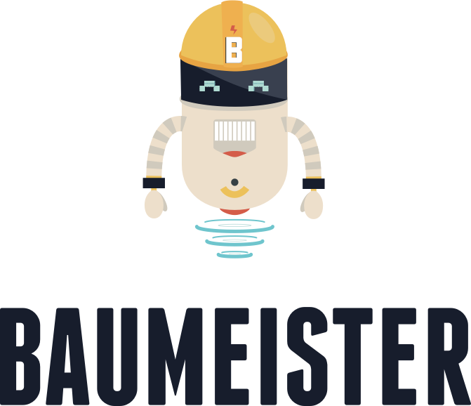

[](https://travis-ci.org/micromata/baumeister)
[](https://david-dm.org/micromata/baumeister)
[](https://david-dm.org/micromata/baumeister#info=devDependencies)
[](https://gitter.im/micromata/baumeister?utm_source=badge&utm_medium=badge&utm_campaign=pr-badge&utm_content=badge)
[](https://twitter.com/baumeister.io)
[](https://www.youtube.com/watch?v=qRC4Vk6kisY)

# Baumeister – a build workflow for your web development needs



The aim of this project is to help you to build your things. From Bootstrap themes over static websites to single page applications. Baumeister provides:

- a file structure with focus on maintainability and upgradability
- a Gulp workflow with the following »features«
	- generate static sites with ease using handlebars templates
	- transpile, bundle and minify your code
		- ES6 as well as Sass
	- remove `console` output and debugger statements in production files
	- add vendor prefixes
	- lint JavaScript, Sass and HTML
	- optimize images (lossless)
	- start a local server
	- keep browsers in sync for testing
	- delete unused CSS (optional)
	- check for know vulnerabilities in dependencies
	- release new versions
	- run unit tests and create coverage reports
	- and more.

## Table of Contents

- [Quick install guide](#quick-install-guide)
- [Dependencies](#dependencies)
- [Setting up the project](#setting-up-the-project)
- [Gulp Workflow and tasks](#gulp-workflow-and-tasks)
- [Setting up your Editor (optional)](#setting-up-your-editor-optional)
- [Writing Markup (using pages, layouts and partials)](#writing-markup-using-pages-layouts-and-partials)
- [File and folder structure of Sass files](#file-and-folder-structure-of-sass-files)
- [Using external libraries](#using-external-libraries)
- [Unit tests](#unit-tests)
- [Configuring linters](#configuring-linters)
- [Release Workflow](#release-workflow)
- [Contributing to this project](#contributing-to-this-project)
- [License](#license)

## Quick install guide

For those already using Node, Gulp and stuff.

### via Yeoman

	$ npm install -g yo
	$ npm install -g generator-baumeister
	$ yo baumeister
	$ gulp --tasks

See: <https://github.com/micromata/generator-baumeister>

### via Git

	$ git clone https://github.com/micromata/baumeister.git
	$ cd baumeister
	$ npm install
	$ gulp --tasks

## Dependencies

- Node.js (>=6.0.0)
- Gulp

### Node.js

The major dependency is [Node.js](http://nodejs.org/) including the Node.js package manager called »npm«. The other dependencies can be installed with npm.

Please enter the following in your terminal if your aren’t sure about the availability of Node.js and npm on your machine:

	node --version

This should return something like the following in case Node.js and npm is already installed:

	v6.10.2

If that isn’t the case you have to install Node.js first. On OS X we strongly recommend installing Node via [Homebrew](https://brew.sh/) or [Node Version Manager](https://github.com/creationix/nvm). Not just because it’s easier to switch versions but also because you prevent potential permission problems when running npm.

### Gulp

This project uses [Gulp](http://gulpjs.com/) for its build system, with convenient methods for working with the project. It's how we compile and minify our code, at vendor prefixes, optimize images, delete unused CSS, release new versions and more.

#### Installing Gulp

Thanks do Node.js and npm installing the Gulp command line tools globally is just this simple one-liner:

	npm install --global gulp-cli

<a name="setup"></a>
## Setting up the project

Navigate to the root of your checkout:

	cd path/to/your/checkout/of/baumeister

and call:

	npm install

npm will look at the `package.json` file and automatically fetch and install the necessary local dependencies needed for our Gulp workflow as well as the needed frontend dependencies to `\node_modules`.

## Gulp Workflow and tasks

When completed the setup, you'll be able to run the various Gulp tasks provided from the command line.

Just type the following to get an overview about the available Tasks:

	gulp --tasks

This will give you the main Gulp tasks which are ready for you to be fired from the terminal.:

````
Tasks for ~/Documents/Projects/baumeister/gulpfile.babel.js
├── build                 `gulp build` is the main build task
│   --production          … builds for production to `dist` directory.
│   -P                    … Alias for --production
├── default               `gulp` will build, serve, watch for changes and reload server
├── lint                  `gulp lint` lints JavaScript via ESLint
├── release               `gulp release` builds the current sources and bumps version number
│   --bump major          … major release (1.0.0). See http://semver.org
│   --bump minor          … minor release (0.1.0). See http://semver.org
│   --bump patch          … patch release (0.0.1). See http://semver.org
│   -B major|minor|patch  … alias to --bump
├── serve                 `gulp serve` serves the build (`server` directory)
│   --production          … serves production build (`dist` directory)
│   -P                    … Alias for --production
├── test                  `gulp test` runs unit test via Jest CLI
│   --production          … exits with exit code 1 when tests are failing (CI)
│   --watch               … runs unit test with Jests native watch option
│   -P                    … Alias for --production
│   -W                    … Alias for --watch
└── watch                 `gulp watch` watches for changes and runs tasks automatically
````
Running those tasks will create a bunch of directories and files which aren’t under version control. So don’t wonder when the following resources are created after setting up and working with the project:

````
myProject
├──.browserify-cache-client.json    → Browserify cache file
├──.browserify-cache-vendor.json    → Browserify cache file
├──.metalsmith-build                → Compiled handlebars sources
├── dist                            → Contains the files ready for production
│   ├── app
│   ├── assets
│   └── libs                        → Relevant files copied from /node_modules
├── coverage                        → Test coverage reports
├── node_modules/                   → Dependencies installed by npm
├── server                          → Contains the files for the development server
│   ├── app
│   ├── assets
│   └── libs                        → Relevant files copied from /node_modules
└── src
    └── assets
        └── css                     → Transpiled and autoprefixed from Sass files
````

See `/gulpfile.babel.js` to see what happens in Details.

### Setting up your Editor (optional)

We strongly advise to install an [EditorConfig plugin](http://editorconfig.org/#download) and take a look at the `.editorconfig` file in the root of this project.

Beside that we recommend setting up a project within in your editor if you don’t want to see these generated files cluttered all over your project. In case of Sublime Text it’s as easy as hitting »Project« → »Save Project As …« and adding the following to `projectName.sublime-project`.

```json
{
  "folders": [{
    "path": ".",
    "folder_exclude_patterns": [
      "node_modules",
      "server",
      "dist",
      "src/assets/css",
			".git"
    ],
    "file_exclude_patterns": [
      ".editorconfig",
      ".travis.yml",
			".browserify-cache-client.json",
			".browserify-cache-vendor.json",
			".DS_Store"
    ]
  }]
}
```

## Writing Markup (using pages, layouts and partials)
Using handlebars we can simplify our templates and avoid markup duplications by using a combination of `pages`, `layouts` and `partials`.

### This is optional
Using Handlebars instead of plain HTML is fully optional and will probably suit your needs if you use Baumeister for creating a static site. If you are developing a single page application instead you might turn of handlebars compiling and place `.html` files in the `/src` directory.

In this case you have turn of Handlebars compiling in `gulp/config.js`:

```javascript
/**
 * Boolean flag to set when using handlebars instead of plain HTML files in `src`.
 */
export const useHandlebars = true;
```

### Using handlebars

It’s super easy to use even if you never used Handlebars before.
Because every valid HTML page is a valid Handlebars template. But handlebars gives you some extra power. So you can:

- write plain HTML
- use [built-In helpers](http://handlebarsjs.com/builtin_helpers.html) provided by Handlebars
- go crazy with [custom helpers](http://handlebarsjs.com/block_helpers.html) :heart_eyes:

Let’s dive into it by describing a minimal example. Imagine that we have a simplified file/folder structure like the following in our project:

```
src
├── index.hbs              → A page
├── anotherPage.hbs        → Another page
└── handlebars
    ├── helpers            → Place to store custom handlebars helpers (usage optional)
    │   └── addYear.js
    ├── layouts            → Place to store our layouts
    │   └── default.hbs    → Our default layout
    └── partials           → Place to store our partials (usage optional)
        └── footer.hbs
```

As you can see our pages are stored in the root of the project and are rendered as `html` pages with a little help of Handlebars.

Let’s take a look at the content of our files.

#### Custom helper

Content of `src/handlebars/helpers/addYear.js`:

```javascript
/**
 * Adds the current year to a string. Divides given string and year by a space.
 * @example:
 * {{addYear '©'}} --> © 2017
 *
 */
function addYear(s) {
	return s + ' ' + new Date().getFullYear();
}

module.exports = addYear;
```

#### Partial

Content of `src/handlebars/partials/footer.hbs`:

```handlebars
<footer>
	{{addYear '©'}} MyCompany
</footer>
```

#### Page

Content of `src/index.hbs`:

```handlebars
---
title: My page title
---
<h1>My page</h1>

<p>My content</p>

{{> footer }}
```

#### Layout file

content of `src/handlebars/layouts/default.hbs`:

```handlebars
<!DOCTYPE html>
<html>
<head>
	<meta charset="utf-8">
	<title>My Project{{#if page.title}} - {{page.title}}{{/if}}</title>
	<link rel="stylesheet" href="">
</head>
<body>
 {{{contents}}}
</body>
</html>
```

#### Rendered Result

This combination will render to one html file.

Content of `index.html`:

```html
<!DOCTYPE html>
<html>
<head>
	<meta charset="utf-8">
	<title>My Project - My page title</title>
	<link rel="stylesheet" href="">
</head>
<body>
	<h1>My page</h1>

	<p>My content</p>

	<footer>
		© 2017 MyCompany
	</footer>
</body>
</html>
```

So the layout file is wrapped around the pages by replacing the `{{{contents}}}` placeholder with the pages content.

As you can see you can enrich your pages with data via so called frontmatters:

```
---
title: My page title
---
```

Frontmatters are basically a key/value storage you can access within your layouts, pages and partials via Handlebars.  This empowers you to do things like [handling active states](https://github.com/micromata/baumeister/blob/master/src/handlebars/partials/navbar.hbs#L16-L22) of your navigation and much more.

There is one predefined key which let you choose a different layout file in case you’re using more than one:

```
---
layout: myOtherTemplate.hbs
---
```

This would need the presence of a layout named `myOtherTemplate.hbs` in the `layouts` directory to work properly. You don’t need to define the layout within your frontmatter in case you would like to use the default layout.

## File and folder structure of Sass files

This is s short version of our conventions when it comes to create bootstrap themes. Below you’ll find the folder and file structure we are using:

```bash
src/assets/scss
├── _print.scss
├── _theme.scss
├── _variables.scss
├── index.scss
└── theme
    ├── _alerts.scss
    ├── _demoElements.scss
    ├── _footer.scss
    ├── _mixins.scss
    ├── _scaffolding.scss
    └── _testResponsiveHelpers.scss
```


Seems to be a pretty huge amount of files for such a little project. So here we go with an explanation.

### index.scss
Our main Sass file is the one which is creating our index.css file. This file is just about a few imports.

```scss
// Import our variables to override Bootstraps default ones
@import "./variables";

// Bootstrap Core
// --------------------------------------------------
@import "../../../node_modules/bootstrap-sass/assets/stylesheets/bootstrap";

/**
 * --------------------------------------------------
 * Here begins our own CSS in the rendered CSS file.
 */

// Theme
// --------------------------------------------------
@import "./theme";

// Print Styles
// --------------------------------------------------
// Use this file to reduce ink an optimize the readability and accessibility of the pages.
// @import "./print";

////////// Do NOT insert style-definitions here! //////////

```

### \_theme.scss

We use this file to import the modules/files which defines the actual theme. You could also use this to write down your styles and omit using separate files in the corresponding folder `theme`. But that’s not a recommendation. See content of `_theme.scss`:

```scss
// Override and extend Bootstrap stuff
// --------------------------------------------------
// Files, classes, mixins etc.
@import "theme/mixins";
@import "theme/scaffolding";
@import "theme/alerts";

// Own modules
// --------------------------------------------------
// @import "theme/testResponsiveHelpers"; // debug
@import "theme/demoElements";
@import "theme/footer";

// Important note //
// You could also use this file to insert theme related style definitions
// directly within this file. But we recommend to exclude your LESS code to
// separate files like the examples above when you exceed a few hundred lines
// of code. Otherwise it will definitely have a negative impact on
// maintainability.
```

### Theme folder

This folder holds the modules needed by the theme. The skeleton of such a module looks like the following.

```scss
//
// Component name
// --------------------------------------------------
// Short component description

.component-name {
	// Local variables
	//
	// Which are meant to be used only in this module. »Global« variables are stored
	// in /src/assets/scss/_variables.scss

	// Local mixins
	//
	// Which are meant to be used only in this module. »Global« mixins are stored
	// in /src/assets/scss/theme/_mixins.scss

	// Styles
	//

}

```

See [_footer.sass](src/assets/scss/theme/_footer.scss) for a »real life« example.

There are three files which differ from regular components. Please have a look at comments within the following files to get an idea how to handle them:

- [_variables.scss](src/assets/scss/_variables.scss)
	Used to override bootstrap variables. Make sure to read the comments which describe how to handle this file which can save you lots of time when it comes to a Bootstrap update.
- [_mixins.scss](src/assets/scss/theme/_mixins.scss)
	Holds additional global mixins which are meant to be used across modules.
- [_scaffolding.scss](src/assets/scss/theme/_scaffolding.scss)
	Used to define the most generic html elements.

## Using external libraries

Let’s assume you like to ad some fanciness to your form select fields. This could be accomplished with [Select2](https://github.com/select2/select2).

This is how you get the files into your `/node_modules` directory and define the dependency in the `package.json` file.

	cd path/to/your/checkout/of/baumeister
	npm search select2

This leads to something like:

```
NAME                      | DESCRIPTION          | AUTHOR          | DATE       | VERSION  | KEYWORDS
select2                   | Select2 is a jQuery… | =chrisjbaik…    | 2016-05-27 |          | select autocomplete typeahead dropdown multiselect tag tagging
Select2                   | Select2 is a jQuery… | =syastrebov     | 2016-08-05 |          | select autocomplete typeahead dropdown multiselect tag tagging
ember-power-select        | The extensible…      | =cibernox       | 2017-03-17 |          | ember-addon select select2 selectize dropdown
select2-bootstrap-css     | Simple CSS to make…  | =fk             | 2015-02-03 |          | bootstrap select2 css
vue-select                | A native Vue.js…     | =sagalbot       | 2017-03-12 |          |
```

where the Name is your key for installation. In our use case you would the do:

	npm install --save select2

which will:

- download the latest and greatest version to your `node_modules` directory
- add `"select2": "~4.0.3"` to your `package.json`

### Using and bundling JavaScript dependencies

You have to decide whether to use ES6 imports or `require` your dependency in the commonJS way depending on the module format your dependency provides.

Example:

```javascript
import $ from 'jquery';
// this is necessary because bootstrap itself checks the existence of jQuery with window.jQuery.
window.jQuery = $;

// Because of bootstrap and select2 aren’t UMD modules, we can’t import them using ES6 syntax.
require('bootstrap');
require('select2');
```

Finally add the library to the `bundleExternalJS` section of `package.json` to add the sources the `vendor.js` bundle.

```
bundleExternalJS": ["jquery", "bootstrap", "select2"]
```
The bundled JavaScript is stored in the `libs` directory during the build process:

```
myProject
├── server
│   └── libs
│       └── vendor.js
└── dist
    └── libs
        └── vendor.min.js
```

### Bundling CSS from dependencies

If your lib ships its own CSS you have to include the path to the files you like to bundle in the `bundleCSS` section of your `package.json`. Please note that glob pattern matching is supported over here.

```
"bundleCSS": [
	"select2/dist/css/select2.css",
	"select2-bootstrap-css/select2-bootstrap.css"
]
```

The bundled CSS is stored in the `libs` directory during the build process:

```
myProject
├── server
│   └── libs
│       └── libs.css
└── dist
    └── libs
        └── libs.min.css
```

### Including static files from dependencies

Sometimes you need to copy static files from an npm package to your project. This may be fonts or JavaScript files you need to include via a seperate `<script>` tag.
To handle that you just have to include the files in the `includeStaticFiles` section of your `package.json`. Please note that glob pattern matching is supported over here.

```
"includeStaticFiles": [
    "bootstrap/fonts/**/*",
    "html5shiv/dist/html5shiv-printshiv.min.js",
    "respond.js/dest/respond.min.js"
]
```

These files are stored in the `libs` directory during the build process:

```
myProject
├── server
│   └── libs
│       ├── bootstrap
│       │   └── fonts
│       │       ├── glyphicons-halflings-regular.eot
│       │       ├── glyphicons-halflings-regular.svg
│       │       ├── glyphicons-halflings-regular.ttf
│       │       ├── glyphicons-halflings-regular.woff
│       │       └── glyphicons-halflings-regular.woff2
│       ├── html5shiv
│       │   └── dist
│       │       └── html5shiv-printshiv.min.js
│       └── respond.js
│           └── dest
│               └── respond.min.js
└── dist
    └── libs
        ├── bootstrap
        │   └── fonts
        │       ├── glyphicons-halflings-regular.eot
        │       ├── glyphicons-halflings-regular.svg
        │       ├── glyphicons-halflings-regular.ttf
        │       ├── glyphicons-halflings-regular.woff
        │       └── glyphicons-halflings-regular.woff2
        ├── html5shiv
        │   └── dist
        │       └── html5shiv-printshiv.min.js
        └── respond.js
            └── dest
                └── respond.min.js
```

### Changing versions of external resources

You can change the version of the external resources by editing the `package.json` file within the root directory of the project by hand.

	"dependencies": {
	  "bootstrap": "~3.2.0",
	  "jquery": "^1.11.1",
	  "html5shiv": "^3.7.2",
	  "respondJs": "~1.4.2",
	  "jquery-placeholder": "2.0.8"
	}

The tilde `~` means: Install the latest version including patch-releases.
The caret `^` means: Install the latest version including minor-releases.

So `~3.2.0` installed the latest 3.2.x release which is version v3.2.0 in case of Bootstrap right now. So  Bootstrap 3.2.1 will be fetched as soon as it is released when you call `npm update` or `npm install`. But npm won’t install Bootstrap 3.3.x or later.

Where `^1.11.1` installed the latest 1.x.x release which is version 1.11.1 in case of jQuery right now. So jQuery 1.11.2 as well as jQuery 1.12.0 will be fetched as soon as it is released when you call `npm update` or `npm install`. But npm won’t install jQuery 2.x.x or later.

Check <http://semver-ftw.org> for more information about »Semantic Versioning«.

#### Updating beyond defined semver ranges

There are multiple ways to get newer versions than defined via the semver ranges in your `package.json`

##### Updating single dependencies via CLI

You can use npm to update single dependencies and persist changes to your `package.json`

For example:

```
npm install --save bootstrap@latest
```

##### Updating multiple dependencies at once

We recommend using a command line tool like »[npm-check-update](https://github.com/tjunnone/npm-check-updates)« to update multiple dependencies at once.

## Unit tests

We use [Jest](https://facebook.github.io/jest/), for running unit test and generating test coverage reports.
See config in property `jest` in `package.json`.

Just type the following to run all test once:

```
npm test
```

You can watch changes and run tests automatically with:

```
npm run test:watch
```
This comes in handy since it’s blazingly fast. It runs only tests related to changed files per default but has an interactive mode which enables you to run all if needed.

### For those who are new to Jest

Writing test with Jest feels pretty much the same like writing tests with Mocha/Chai|Jasmine.
Just have a look at our small dummy test in `src/app/__tests__`.

Placing tests in `__tests__` directories is a default from Jest.
You can adjust the name of your tests-directory with the `testDirectoryName` configuration option.

The most important things to know:
- [API docs](https://facebook.github.io/jest/docs/api.html)
- [Assertions](https://facebook.github.io/jest/docs/expect.html)

*Your are not forced to use Jests assertions. You can alternatively use `assert` by just requiring it or install and use Chai.*

We strongly recommend to check the [docs](https://facebook.github.io/jest/docs/getting-started.html) to dive deeper and read for instance how Jest can help you with mocking.

## Configuring linters

Below you’ll find information how to adapt the rules in case they don’t fit your preferences.

### ESLint (JavaScript)

We are using [eslint-config-xo](https://github.com/sindresorhus/eslint-config-xo) as presets but adapted a few rules within:

```
.eslintrc.json
```

See [ESLint rules](http://eslint.org/docs/rules/) in case you like get details to these rules.

In addition we extend the settings for client code in:

```
src/app/.eslintrc.json
```

See [Configuring ESLint](http://eslint.org/docs/user-guide/configuring) if you need to know more.


### stylelint (Sass)

We are using [stylelint-config-standard](https://github.com/stylelint/stylelint-config-standard) as presets but adapted a few rules within:

```
.stylelintrc.json
```

See [stylelint rules](https://stylelint.io/user-guide/rules/) in case you like get details to these rules.

### Bootlint (Markup)

We are using [Bootlint](https://github.com/twbs/bootlint) to check for potential markup errors when using Bootstrap.
You can disable certain [rules](https://github.com/twbs/bootlint/wiki) within:

```
gulp/tasks/lintBootstrap.js
```

## Release Workflow

We provide a task to automate releases with the following options:

```
gulp release --bump (major|minor|patch|prerelease|premajor|preminor|prepatch) [--prerelease-identifier <yourIdentifier>]
```

*Hint: With `-B` there is a shorter alias available for `--bump`.*

See <http://semver.org> for details when to choose which release type.

The release task will:

- bump the version number in `package.json`
- generate a changelog
- commit changes
- create a Git tag

**Examples**

```
# Bump version from 3.1.2 to 4.0.0
gulp release -B major

# Bump version from 3.1.2 to 3.2.0
gulp release -B minor

# Bump version from 3.1.2 to 3.1.3
gulp release -B patch

# Bump version from 3.1.2 to 4.0.0-beta.0
gulp release -B premajor --prerelease-identifier beta

# Bump prerelease version eg. from 4.0.0-beta.0 to 4.0.0-beta.1
gulp release -B prerelease
```

### Changelog creation

The changelog is stored in the file `CHANGELOG.MD` in the project root. Every release updates this file.

We are using »conventional changelog« to get relevant changes out of the git commit history and group them nicely.

You should write your commit messages with this [conventions](https://github.com/conventional-changelog/conventional-changelog/blob/master/packages/conventional-changelog-angular/convention.md) in mind.

See the last [commits](https://github.com/micromata/baumeister/commits) of Baumeister for some real life commit messages.

#### Short summary of the conventions

Example commit message:
```
fix(uglify): Remove console output and debugger statements
```
Consists of:
```
type(scope): subject
```
##### Types

Types are used to group commits in the changelog.
Possible types which are rendered in the changelog are: `feat`, `fix` and `perf`.

There are additional ones which you can use. But these are only rendered if they introduce a breaking change:
`docs`, `chore`, `style`, `refactor`, and `test`.

##### Scope

The scope is optional and you can choose from whatever you want.
The scope is used as another grouping element below the type.

You can skip the parentheses if you don’t want to use Scope:
```
style: Fix linting errors
```

##### Subject

The subject contains succinct description of the change:

* use the imperative, present tense: "change" not "changed" nor "changes"
* capitalize first letter
* no dot (.) at the end

##### Additional Info,  Breaking changes and issue references

Are defined in the body of the commit message.

Example:
```
feat(build): Replace Grunt with Gulp
<BLANK LINE>
Closes #28
BREAKING CHANGE: Grunt Tasks aren’t available any longer.
But there are equvalent Gulp tasks.
List the available tasks with `gulp --tasks`
```
The body can include the motivation for the change and contrast this with previous behavior.

Plus it should contain any information about **Breaking Changes** and is also the place to
reference GitHub issues that this commit **Closes**.

**Breaking Changes** should start with the word `BREAKING CHANGE:` with a space or two newlines. The rest of the commit message is then used for this.

#### Generated Changelog

This is how a changelog based on this conventions is rendered:
https://github.com/angular/angular/blob/master/CHANGELOG.md

## Contributing to this project

Anyone and everyone is welcome to contribute. Please take a moment to
review the [guidelines for contributing](CONTRIBUTING.md).

* [Bug reports](CONTRIBUTING.md#bugs)
* [Feature requests](CONTRIBUTING.md#features)
* [Pull requests](CONTRIBUTING.md#pull-requests)

## License

Please be aware of the licenses of the components we use in this project.
Everything else that has been developed by the contributions to this project is under [MIT License](LICENSE).
